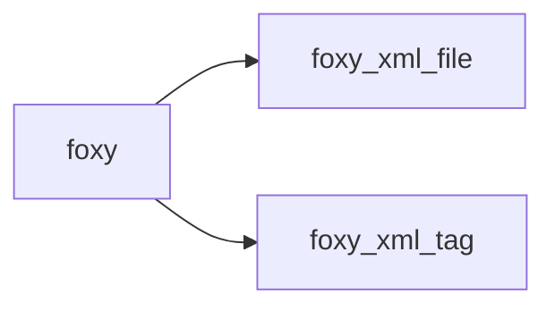

# foxy

> FoXy, Fortran XML parser for poor people

**Source**: `src/lib/foxy.f90`

**Dependencies**

```mermaid
graph LR
  foxy["foxy"] --> foxy_xml_file["foxy_xml_file"]
  foxy["foxy"] --> foxy_xml_tag["foxy_xml_tag"]
```
