# foxy_xml_file

> FoXy XML file class.

**Source**: `src/lib/foxy_xml_file.f90`

**Dependencies**

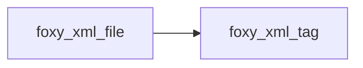

## Contents

- [xml_file](#xml-file)
- [add_tag](#add-tag)
- [delete_tag](#delete-tag)
- [free](#free)
- [parse](#parse)
- [add_child](#add-child)
- [parse_from_string](#parse-from-string)
- [stringify_recursive](#stringify-recursive)
- [finalize](#finalize)
- [find_matching_end_tag](#find-matching-end-tag)
- [get_tag_content](#get-tag-content)
- [parse_tag_name](#parse-tag-name)
- [content](#content)
- [stringify](#stringify)
- [load_file_as_stream](#load-file-as-stream)

## Derived Types

### xml_file

XML file class.

#### Components

| Name | Type | Attributes | Description |
|------|------|------------|-------------|
| `tag` | type([xml_tag](/api/src/lib/foxy_xml_tag#xml-tag)) | allocatable | XML tags array. |
| `nt` | integer(kind=I4P) |  | Number of XML tags. |

#### Type-Bound Procedures

| Name | Attributes | Description |
|------|------------|-------------|
| `add_tag` | pass(self) | Add tag to XML file. |
| `content` | pass(self) | Return tag content of tag named *name*. |
| `delete_tag` | pass(self) | Add tag from XML file. |
| `free` | pass(self) | Free dynamic memory. |
| `parse` | pass(self) | Parse xml file. |
| `stringify` | pass(self) | Convert the whole file data into a string. |
| `add_child` | pass(self) | Add child ID to tag children list. |
| `parse_from_string` | pass(self) | Parse xml data from string. |
| `stringify_recursive` | pass(self) | Convert recursively tags with children into a string. |

## Subroutines

### add_tag

Add tag to XML file.

**Attributes**: elemental

```fortran
subroutine add_tag(self, tag)
```

**Arguments**

| Name | Type | Intent | Attributes | Description |
|------|------|--------|------------|-------------|
| `self` | class([xml_file](/api/src/lib/foxy_xml_file#xml-file)) | inout |  | XML file. |
| `tag` | type([xml_tag](/api/src/lib/foxy_xml_tag#xml-tag)) | in |  | XML tag. |

**Call graph**

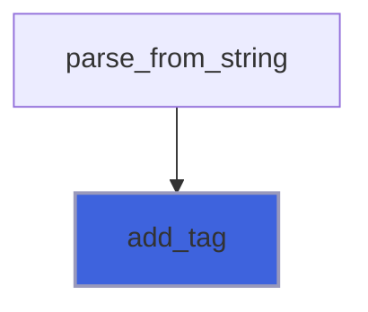

### delete_tag

Delete tag from XML file.

**Attributes**: elemental

```fortran
subroutine delete_tag(self, name)
```

**Arguments**

| Name | Type | Intent | Attributes | Description |
|------|------|--------|------------|-------------|
| `self` | class([xml_file](/api/src/lib/foxy_xml_file#xml-file)) | inout |  | XML file. |
| `name` | character(len=*) | in |  | XML tag name. |

**Call graph**

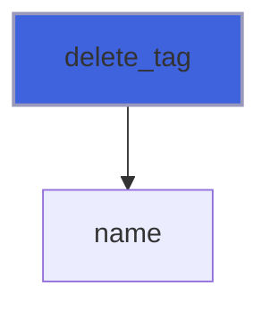

### free

Free dynamic memory.

**Attributes**: elemental

```fortran
subroutine free(self)
```

**Arguments**

| Name | Type | Intent | Attributes | Description |
|------|------|--------|------------|-------------|
| `self` | class([xml_file](/api/src/lib/foxy_xml_file#xml-file)) | inout |  | XML file. |

### parse

Parse xml data from string or file.
 XML data is linearized, a DOM structured is used.

 @note Self data are free before trying to parse new xml data: all previously parsed data are lost.

```fortran
subroutine parse(self, string, filename)
```

**Arguments**

| Name | Type | Intent | Attributes | Description |
|------|------|--------|------------|-------------|
| `self` | class([xml_file](/api/src/lib/foxy_xml_file#xml-file)) | inout |  | XML file. |
| `string` | character(len=*) | in | optional | String containing xml data. |
| `filename` | character(len=*) | in | optional | File name containing xml data. |

**Call graph**

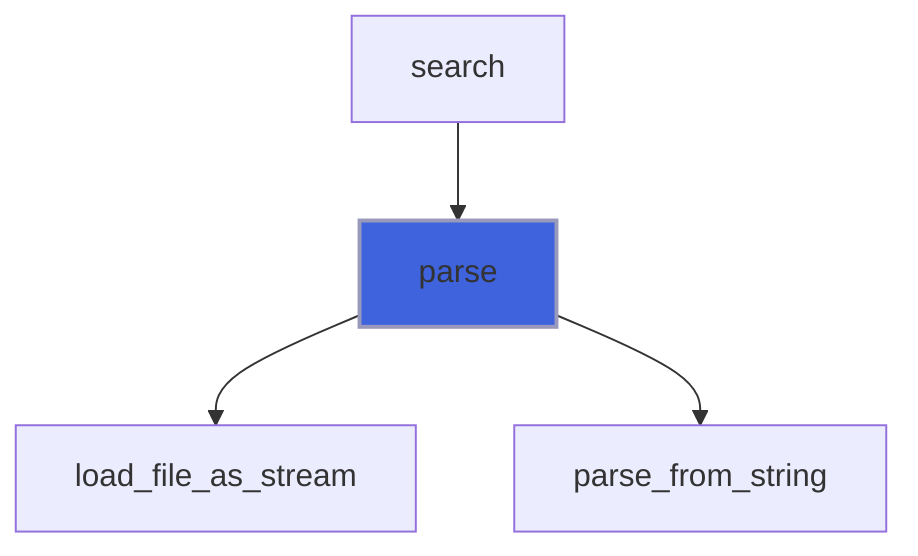

### add_child

Add child ID to tag children list.

**Attributes**: pure

```fortran
subroutine add_child(self, parent_id, child_id)
```

**Arguments**

| Name | Type | Intent | Attributes | Description |
|------|------|--------|------------|-------------|
| `self` | class([xml_file](/api/src/lib/foxy_xml_file#xml-file)) | inout |  | XML file handler. |
| `parent_id` | integer(kind=I4P) | in |  | Parent ID. |
| `child_id` | integer(kind=I4P) | in |  | Child ID. |

**Call graph**

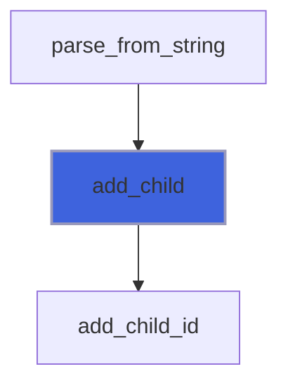

### parse_from_string

Parse xml data from a chunk of source string (file stringified for IO on device).

**Attributes**: pure

```fortran
subroutine parse_from_string(self, source_string)
```

**Arguments**

| Name | Type | Intent | Attributes | Description |
|------|------|--------|------------|-------------|
| `self` | class([xml_file](/api/src/lib/foxy_xml_file#xml-file)) | inout |  | XML file handler. |
| `source_string` | character(len=*) | in |  | String containing xml data. |

**Call graph**

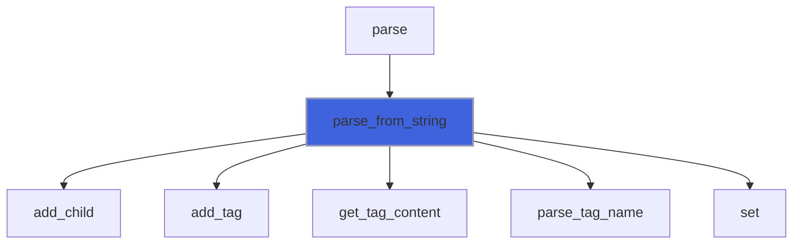

### stringify_recursive

Convert recursively tags with children into a string.

**Attributes**: pure, recursive

```fortran
subroutine stringify_recursive(self, tag, is_done, tag_string)
```

**Arguments**

| Name | Type | Intent | Attributes | Description |
|------|------|--------|------------|-------------|
| `self` | class([xml_file](/api/src/lib/foxy_xml_file#xml-file)) | in |  | XML file. |
| `tag` | type([xml_tag](/api/src/lib/foxy_xml_tag#xml-tag)) | in |  | XML tag with children. |
| `is_done` | logical | inout |  | List of stringified tags. |
| `tag_string` | character(len=:) | inout | allocatable | Output string containing the current tag. |

**Call graph**

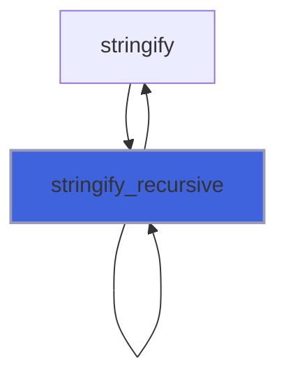

### finalize

Free dynamic memory when finalizing.

```fortran
subroutine finalize(self)
```

**Arguments**

| Name | Type | Intent | Attributes | Description |
|------|------|--------|------------|-------------|
| `self` | type([xml_file](/api/src/lib/foxy_xml_file#xml-file)) | inout |  | XML file. |

### find_matching_end_tag

**Attributes**: pure

```fortran
subroutine find_matching_end_tag(source, start_pos, tag_name, end_pos)
```

**Arguments**

| Name | Type | Intent | Attributes | Description |
|------|------|--------|------------|-------------|
| `source` | character(len=*) | in |  | Source containing tag content. |
| `start_pos` | integer(kind=I4P) | in |  | Start tag content position. |
| `tag_name` | character(len=*) | in |  | Tag name. |
| `end_pos` | integer(kind=I4P) | out |  | End tag position. |

**Call graph**

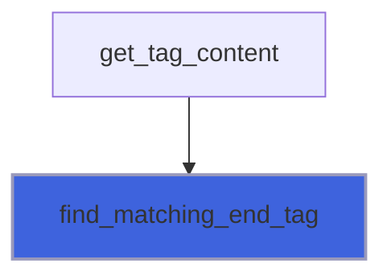

### get_tag_content

Get tag content.

**Attributes**: pure

```fortran
subroutine get_tag_content(source, tag_name, start_pos, content, end_pos)
```

**Arguments**

| Name | Type | Intent | Attributes | Description |
|------|------|--------|------------|-------------|
| `source` | character(len=*) | in |  | Source containing tag content. |
| `tag_name` | character(len=*) | in |  | Tag name. |
| `start_pos` | integer | in |  | Start tag content position. |
| `content` | character(len=:) | out | allocatable | Extracted tag content. |
| `end_pos` | integer(kind=I4P) | out | optional | End tag content position. |

**Call graph**

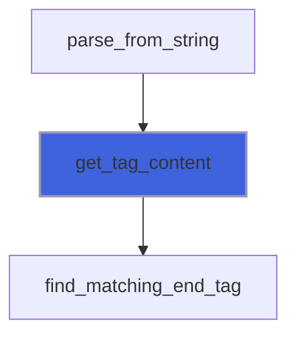

### parse_tag_name

Parse current tag, only name and attributes.

**Attributes**: pure

```fortran
subroutine parse_tag_name(tag_str, tag_name, attributes_str, is_closing, is_self_closing)
```

**Arguments**

| Name | Type | Intent | Attributes | Description |
|------|------|--------|------------|-------------|
| `tag_str` | character(len=*) | in |  | Tag string. |
| `tag_name` | character(len=:) | out | allocatable | Parsed tag name. |
| `attributes_str` | character(len=:) | out | allocatable | Parsed attributes list. |
| `is_closing` | logical | out |  | Sentinel for closing tag. |
| `is_self_closing` | logical | out |  | Sentinel for self closing tag. |

**Call graph**

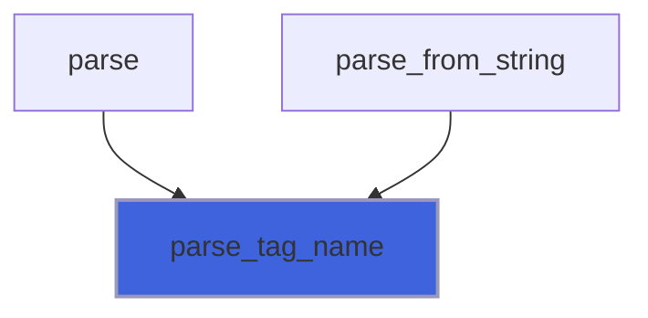

## Functions

### content

Return tag content of tag named *name*.

 @note If there is no value, the *tag_content* string is returned empty, but allocated.

**Attributes**: pure

**Returns**: `character(len=:)`

```fortran
function content(self, name)
```

**Arguments**

| Name | Type | Intent | Attributes | Description |
|------|------|--------|------------|-------------|
| `self` | class([xml_file](/api/src/lib/foxy_xml_file#xml-file)) | in |  | XML file. |
| `name` | character(len=*) | in |  | Tag name. |

**Call graph**

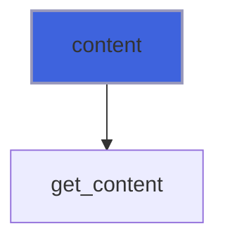

### stringify

Convert the whole file data into a string.

**Attributes**: pure

**Returns**: `character(len=:)`

```fortran
function stringify(self, linearize) result(string)
```

**Arguments**

| Name | Type | Intent | Attributes | Description |
|------|------|--------|------------|-------------|
| `self` | class([xml_file](/api/src/lib/foxy_xml_file#xml-file)) | in |  | XML file. |
| `linearize` | logical | in | optional | Return a "linearized" string of tags without the XML hieararchy. |

**Call graph**

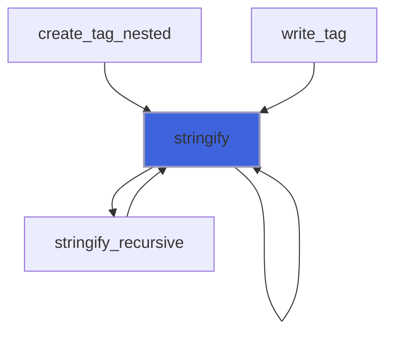

### load_file_as_stream

Load file contents and store as single characters stream.

**Returns**: `character(len=:)`

```fortran
function load_file_as_stream(filename, delimiter_start, delimiter_end, fast_read, iostat, iomsg) result(stream)
```

**Arguments**

| Name | Type | Intent | Attributes | Description |
|------|------|--------|------------|-------------|
| `filename` | character(len=*) | in |  | File name. |
| `delimiter_start` | character(len=*) | in | optional | Delimiter from which start the stream. |
| `delimiter_end` | character(len=*) | in | optional | Delimiter to which end the stream. |
| `fast_read` | logical | in | optional | Flag for activating efficient reading with one single read. |
| `iostat` | integer(kind=I4P) | out | optional | IO error. |
| `iomsg` | character(len=*) | out | optional | IO error message. |

**Call graph**

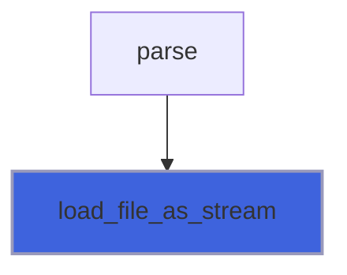
