# foxy_xml_tag

> FoXy XML tag class.

**Source**: `src/lib/foxy_xml_tag.F90`

## Contents

- [xml_tag](#xml-tag)
- [xml_tag](#xml-tag)
- [add_child_id](#add-child-id)
- [free](#free)
- [get_content](#get-content)
- [parse](#parse)
- [parse_tag_name](#parse-tag-name)
- [set](#set)
- [write_tag](#write-tag)
- [add_single_attribute](#add-single-attribute)
- [add_multiple_attributes](#add-multiple-attributes)
- [add_stream_attributes](#add-stream-attributes)
- [alloc_attributes](#alloc-attributes)
- [delete_content](#delete-content)
- [delete_single_attribute](#delete-single-attribute)
- [delete_multiple_attributes](#delete-multiple-attributes)
- [get](#get)
- [get_attributes](#get-attributes)
- [get_value](#get-value)
- [parse_attributes_names](#parse-attributes-names)
- [search](#search)
- [assign_tag](#assign-tag)
- [finalize](#finalize)
- [create_tag_flat](#create-tag-flat)
- [create_tag_nested](#create-tag-nested)
- [attributes](#attributes)
- [end_tag](#end-tag)
- [is_attribute_present](#is-attribute-present)
- [is_parsed](#is-parsed)
- [name](#name)
- [self_closing_tag](#self-closing-tag)
- [start_tag](#start-tag)
- [stringify](#stringify)

## Derived Types

### xml_tag

XML tag class.

 A valid XML tag must have the following syntax for a tag without a content (with only attributes):
```xml
   <Tag_Name att#1_Name="att#1_val" att#2_Name="att#2_val"... att#Nt_Name="att#Nt_val"/>
```
 while a tag with a content must have the following syntax:
```xml
   <Tag_Name att#1_Name="att#1_val" att#2_Name="att#2_val"... att#Nt_Name="att#Nt_val">Tag_Content</Tag_Name>
```

 It is worth noting that the syntax is case sensitive and that the attributes are optional. Each attribute name must be
 followed by '="' without any additional white spaces and its value must be termined by '"'. Each attribute is separated
 by one or more white spaces.

#### Components

| Name | Type | Attributes | Description |
|------|------|------------|-------------|
| `tag_name` | type(string) |  | Tag name. |
| `tag_content` | type(string) |  | Tag content. |
| `pos` | integer(kind=I4P) |  | Characters position (in source) indexes (start, content, end). |
| `attribute` | type(string) | allocatable | Attributes names/values pairs, [1:2, 1:]. |
| `attributes_number` | integer(kind=I4P) |  | Number of defined attributes. |
| `indent` | integer(kind=I4P) |  | Number of indent-white-spaces. |
| `is_self_closing` | logical |  | Self closing tag flag. |
| `level` | integer(kind=I4P) |  | Tag hierarchy level. |
| `id` | integer(kind=I4P) |  | Uniq tag ID. |
| `parent_id` | integer(kind=I4P) |  | Uniq ID of parent tag. |
| `children_number` | integer(kind=I4P) |  | Number of children tags. |
| `child_id` | integer(kind=I4P) | allocatable | Uniq ID of children tags. |

#### Type-Bound Procedures

| Name | Attributes | Description |
|------|------------|-------------|
| `add_attributes` |  | Add attributes name/value pairs. |
| `add_child_id` | pass(self) | Add child ID to children IDs list. |
| `attributes` | pass(self) | Return attributes name/value pairs as string. |
| `delete_attributes` |  | Delete attributes name/value pairs. |
| `delete_content` | pass(self) | Delete tag conent. |
| `end_tag` | pass(self) | Return `` end tag. |
| `free` | pass(self) | Free (reset) tag. |
| `get_content` | pass(self) | Return tag content. |
| `is_attribute_present` | pass(self) | Return .true. it the queried attribute name is defined. |
| `is_parsed` | pass(self) | Check is tag is correctly parsed, i.e. its *tag_name* is allocated. |
| `name` | pass(self) | Return tag name. |
| `parse` | pass(self) | Parse the tag contained into a source string. |
| `parse_tag_name` | pass(self) | Parse the tag name contained into a string. |
| `self_closing_tag` | pass(self) | Return `` self closing tag. |
| `set` | pass(self) | Set tag data. |
| `start_tag` | pass(self) | Return `` start tag. |
| `stringify` | pass(self) | Convert the whole tag into a string. |
| `write` | pass(self) | Write tag to unit file. |
| `assignment(=)` |  | Assignment operator overloading. |
| `add_single_attribute` | pass(self) | Add one attribute name/value pair. |
| `add_multiple_attributes` | pass(self) | Add list of attributes name/value pairs. |
| `add_stream_attributes` | pass(self) | Add list of attributes name/value pairs passed as stream. |
| `alloc_attributes` | pass(self) | Allocate (prepare for filling) dynamic memory of attributes. |
| `delete_single_attribute` | pass(self) | Delete one attribute name/value pair. |
| `delete_multiple_attributes` | pass(self) | Delete list of attributes name/value pairs. |
| `get` | pass(self) | Get the tag value and attributes from source. |
| `get_value` | pass(self) | Get the tag value from source after tag_name has been set. |
| `get_attributes` | pass(self) | Get the attributes values from source. |
| `parse_attributes_names` | pass(self) | Parse the tag attributes names contained into a string. |
| `search` | pass(self) | Search tag named *tag_name* into a string. |
| `assign_tag` | pass(lhs) | Assignment between two tags. |

## Interfaces

### xml_tag

Overload *xml_tag* with creator procedures.

**Module procedures**: [`create_tag_flat`](/api/src/lib/foxy_xml_tag#create-tag-flat), [`create_tag_nested`](/api/src/lib/foxy_xml_tag#create-tag-nested)

## Subroutines

### add_child_id

Add child ID to children IDs list.

**Attributes**: pure

```fortran
subroutine add_child_id(self, child_id)
```

**Arguments**

| Name | Type | Intent | Attributes | Description |
|------|------|--------|------------|-------------|
| `self` | class([xml_tag](/api/src/lib/foxy_xml_tag#xml-tag)) | inout |  | XML tag. |
| `child_id` | integer(kind=I4P) | in |  | Child ID. |

**Call graph**

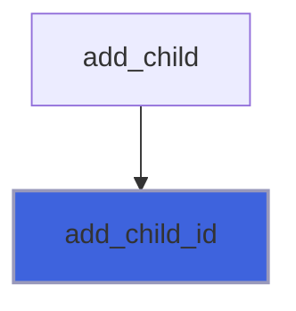

### free

Free (reset) tag.

**Attributes**: elemental

```fortran
subroutine free(self)
```

**Arguments**

| Name | Type | Intent | Attributes | Description |
|------|------|--------|------------|-------------|
| `self` | class([xml_tag](/api/src/lib/foxy_xml_tag#xml-tag)) | inout |  | XML tag. |

### get_content

Return tag content of self (or its nested tags) if named *name*.

 @note If there is no value, the *content* string is returned deallocated.

**Attributes**: pure

```fortran
subroutine get_content(self, name, content)
```

**Arguments**

| Name | Type | Intent | Attributes | Description |
|------|------|--------|------------|-------------|
| `self` | class([xml_tag](/api/src/lib/foxy_xml_tag#xml-tag)) | in |  | XML tag. |
| `name` | character(len=*) | in |  | Searched tag name. |
| `content` | character(len=:) | out | allocatable | Tag content. |

**Call graph**

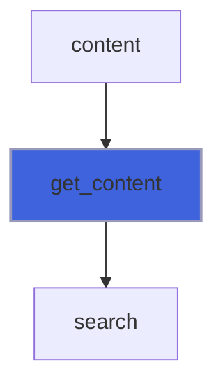

### parse

Parse the tag contained into a source string.

 It is assumed that the first tag contained into the source string is parsed, the others eventually present are omitted.
 Valid syntax are:
 + `<tag_name att1="att1 val" att2="att2 val"...>...</tag_name>`
 + `<tag_name att1="att1 val" att2="att2 val".../>`
 @note Inside the attributes value the symbols `<` and `>` are not allowed.

**Attributes**: elemental

```fortran
subroutine parse(self, source, tstart, tend)
```

**Arguments**

| Name | Type | Intent | Attributes | Description |
|------|------|--------|------------|-------------|
| `self` | class([xml_tag](/api/src/lib/foxy_xml_tag#xml-tag)) | inout |  | XML tag. |
| `source` | character(len=*) | in |  | String containing the input. |
| `tstart` | integer(kind=I4P) | out | optional | Starting index of tag inside the string. |
| `tend` | integer(kind=I4P) | out | optional | Ending index of tag inside the string. |

**Call graph**

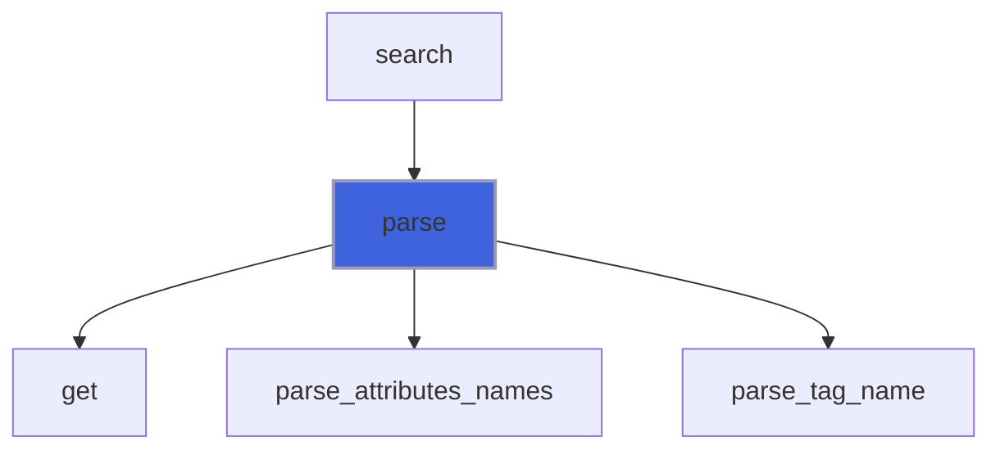

### parse_tag_name

Parse the tag name contained into a string.

 It is assumed that the first tag contained into the source is parsed, the others eventually present are omitted.
 Valid syntax are:
 + `<tag_name att1="att1 val" att2="att2 val"...>...</tag_name>`
 + `<tag_name att1="att1 val" att2="att2 val".../>`
 @note Inside the attributes value the symbols `<` and `>` are not allowed.

**Attributes**: elemental

```fortran
subroutine parse_tag_name(self, source, tstart, tend)
```

**Arguments**

| Name | Type | Intent | Attributes | Description |
|------|------|--------|------------|-------------|
| `self` | class([xml_tag](/api/src/lib/foxy_xml_tag#xml-tag)) | inout |  | XML tag. |
| `source` | character(len=*) | in |  | String containing the input. |
| `tstart` | integer(kind=I4P) | out | optional | Starting index of tag inside the source. |
| `tend` | integer(kind=I4P) | out | optional | Ending index of tag inside the source. |

**Call graph**

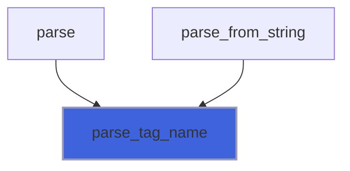

### set

Set tag data.

**Attributes**: pure

```fortran
subroutine set(self, name, attribute, attributes, attributes_stream, sanitize_attributes_value, content, pos, indent, is_content_indented, is_self_closing, id, level, parent_id, attributes_stream_alloc, content_alloc)
```

**Arguments**

| Name | Type | Intent | Attributes | Description |
|------|------|--------|------------|-------------|
| `self` | class([xml_tag](/api/src/lib/foxy_xml_tag#xml-tag)) | inout |  | XML tag. |
| `name` | character(len=*) | in | optional | Tag name. |
| `attribute` | character(len=*) | in | optional | Attribute name/value pair [1:2]. |
| `attributes` | character(len=*) | in | optional | Attributes list of name/value pairs [1:2,1:]. |
| `attributes_stream` | character(len=*) | in | optional | Attributes list of name/value pairs as stream. |
| `sanitize_attributes_value` | logical | in | optional | Sanitize attributes value. |
| `content` | character(len=*) | in | optional | Tag value. |
| `pos` | integer(kind=I4P) | in | optional | Characters position (in source) indexes. |
| `indent` | integer(kind=I4P) | in | optional | Number of indent-white-spaces. |
| `is_content_indented` | logical | in | optional | Activate value indentation. |
| `is_self_closing` | logical | in | optional | The tag is self closing. |
| `id` | integer(kind=I4P) | in | optional | Uniq ID. |
| `level` | integer(kind=I4P) | in | optional | Tag hierarchy level. |
| `parent_id` | integer(kind=I4P) | in | optional | Parent uniq ID. |
| `attributes_stream_alloc` | character(len=:) | in | allocatable, optional | Attributes list stream, allocatable input. |
| `content_alloc` | character(len=:) | in | allocatable, optional | Tag value, allocatable input. |

**Call graph**

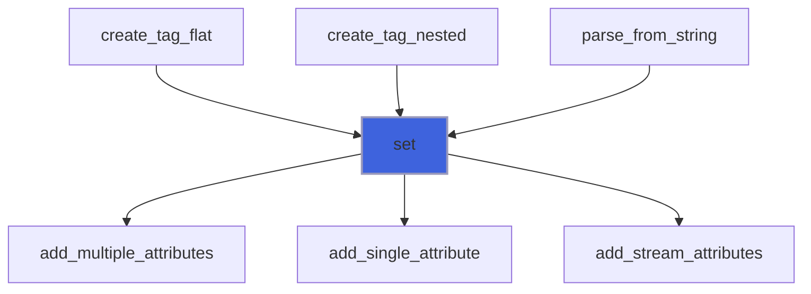

### write_tag

Write tag to unit file.

```fortran
subroutine write_tag(self, unit, is_indented, is_content_indented, form, end_record, only_start, only_content, only_end, iostat, iomsg)
```

**Arguments**

| Name | Type | Intent | Attributes | Description |
|------|------|--------|------------|-------------|
| `self` | class([xml_tag](/api/src/lib/foxy_xml_tag#xml-tag)) | in |  | XML tag. |
| `unit` | integer(kind=I4P) | in |  | File unit. |
| `is_indented` | logical | in | optional | Activate content indentation. |
| `is_content_indented` | logical | in | optional | Activate content indentation. |
| `form` | character(len=*) | in | optional | Format. |
| `end_record` | character(len=*) | in | optional | Ending record. |
| `only_start` | logical | in | optional | Write only start tag. |
| `only_content` | logical | in | optional | Write only content. |
| `only_end` | logical | in | optional | Write only end tag. |
| `iostat` | integer(kind=I4P) | out | optional | IO status. |
| `iomsg` | character(len=*) | out | optional | IO message. |

**Call graph**

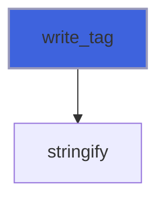

### add_single_attribute

Add one attribute name/value pair.

 @note Leading and trailing white spaces are trimmed out by attribute's name.

**Attributes**: pure

```fortran
subroutine add_single_attribute(self, attribute, sanitize_value)
```

**Arguments**

| Name | Type | Intent | Attributes | Description |
|------|------|--------|------------|-------------|
| `self` | class([xml_tag](/api/src/lib/foxy_xml_tag#xml-tag)) | inout |  | XML tag. |
| `attribute` | character(len=*) | in |  | Attribute name/value pair [1:2]. |
| `sanitize_value` | logical | in | optional | Sanitize attribute value. |

**Call graph**

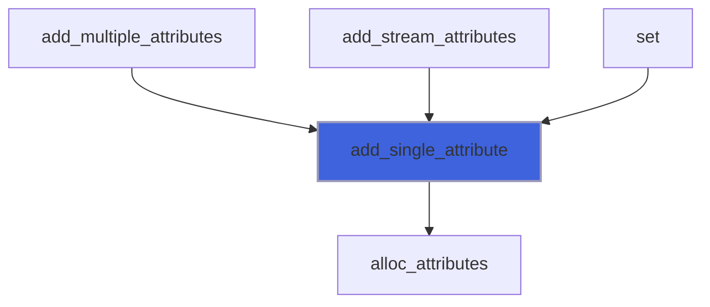

### add_multiple_attributes

Add list of attributes name/value pairs.

**Attributes**: pure

```fortran
subroutine add_multiple_attributes(self, attributes, sanitize_values)
```

**Arguments**

| Name | Type | Intent | Attributes | Description |
|------|------|--------|------------|-------------|
| `self` | class([xml_tag](/api/src/lib/foxy_xml_tag#xml-tag)) | inout |  | XML tag. |
| `attributes` | character(len=*) | in |  | Attribute name/value pair list [1:2,1:]. |
| `sanitize_values` | logical | in | optional | Sanitize attribute values. |

**Call graph**

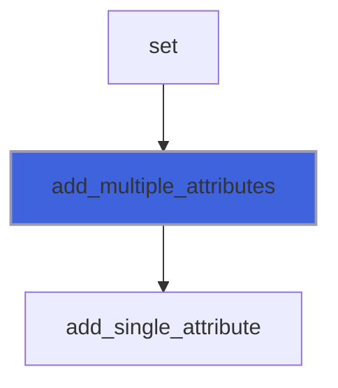

### add_stream_attributes

Add list of attributes name/value pairs passed as stream.

 @note The character `=` cannot compare into the attributes names of values.

**Attributes**: pure

```fortran
subroutine add_stream_attributes(self, attributes_stream, sanitize_values)
```

**Arguments**

| Name | Type | Intent | Attributes | Description |
|------|------|--------|------------|-------------|
| `self` | class([xml_tag](/api/src/lib/foxy_xml_tag#xml-tag)) | inout |  | XML tag. |
| `attributes_stream` | character(len=*) | in |  | Attribute name/value pair list passed as stream. |
| `sanitize_values` | logical | in | optional | Sanitize attribute values. |

**Call graph**

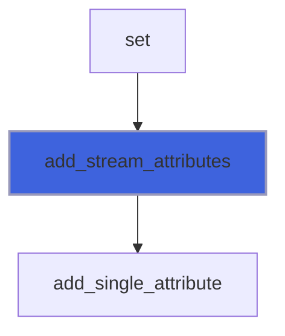

### alloc_attributes

Allocate (prepare for filling) dynamic memory of attributes.

**Attributes**: elemental

```fortran
subroutine alloc_attributes(self, Na)
```

**Arguments**

| Name | Type | Intent | Attributes | Description |
|------|------|--------|------------|-------------|
| `self` | class([xml_tag](/api/src/lib/foxy_xml_tag#xml-tag)) | inout |  | XML tag. |
| `Na` | integer(kind=I4P) | in |  | Number of attributes. |

**Call graph**

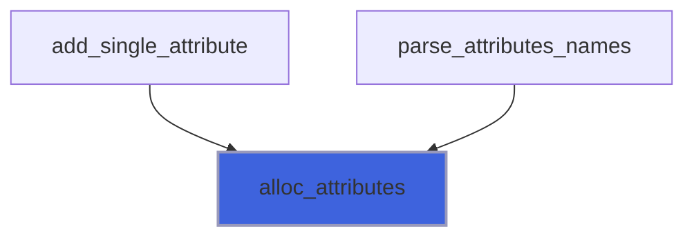

### delete_content

Delete tag content.

**Attributes**: pure

```fortran
subroutine delete_content(self)
```

**Arguments**

| Name | Type | Intent | Attributes | Description |
|------|------|--------|------------|-------------|
| `self` | class([xml_tag](/api/src/lib/foxy_xml_tag#xml-tag)) | inout |  | XML tag. |

### delete_single_attribute

Delete one attribute name/value pair.

**Attributes**: pure

```fortran
subroutine delete_single_attribute(self, name)
```

**Arguments**

| Name | Type | Intent | Attributes | Description |
|------|------|--------|------------|-------------|
| `self` | class([xml_tag](/api/src/lib/foxy_xml_tag#xml-tag)) | inout |  | XML tag. |
| `name` | character(len=*) | in |  | Attribute name. |

**Call graph**

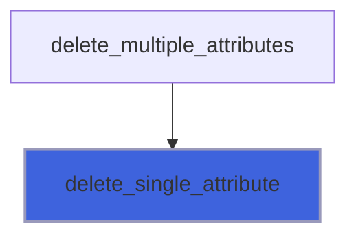

### delete_multiple_attributes

Delete list of attributes name/value pairs.

**Attributes**: pure

```fortran
subroutine delete_multiple_attributes(self, name)
```

**Arguments**

| Name | Type | Intent | Attributes | Description |
|------|------|--------|------------|-------------|
| `self` | class([xml_tag](/api/src/lib/foxy_xml_tag#xml-tag)) | inout |  | XML tag. |
| `name` | character(len=*) | in |  | Attributes names. |

**Call graph**

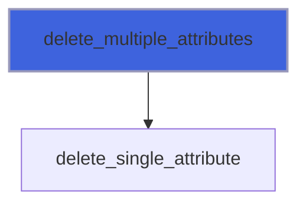

### get

Get the tag content and attributes from source after tag_name and attributes names have been set.

**Attributes**: elemental

```fortran
subroutine get(self, source)
```

**Arguments**

| Name | Type | Intent | Attributes | Description |
|------|------|--------|------------|-------------|
| `self` | class([xml_tag](/api/src/lib/foxy_xml_tag#xml-tag)) | inout |  | XML tag. |
| `source` | character(len=*) | in |  | String containing data. |

**Call graph**

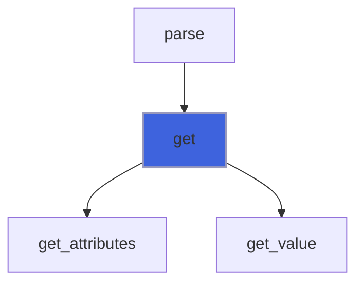

### get_attributes

Get the attributes values from source after tag_name and attributes names have been set.

**Attributes**: elemental

```fortran
subroutine get_attributes(self, source)
```

**Arguments**

| Name | Type | Intent | Attributes | Description |
|------|------|--------|------------|-------------|
| `self` | class([xml_tag](/api/src/lib/foxy_xml_tag#xml-tag)) | inout |  | XML tag. |
| `source` | character(len=*) | in |  | String containing data. |

**Call graph**

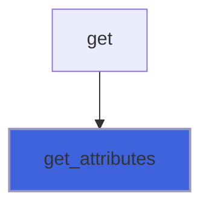

### get_value

Get the tag value from source after tag_name has been set.

**Attributes**: elemental

```fortran
subroutine get_value(self, source)
```

**Arguments**

| Name | Type | Intent | Attributes | Description |
|------|------|--------|------------|-------------|
| `self` | class([xml_tag](/api/src/lib/foxy_xml_tag#xml-tag)) | inout |  | XML tag. |
| `source` | character(len=*) | in |  | String containing data. |

**Call graph**

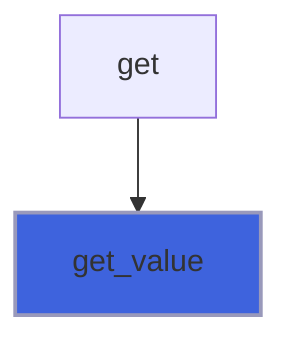

### parse_attributes_names

Parse the tag attributes names contained into a string.

 Valid syntax is:
 + `att1="att1 val" att2="att2 val"...`
 @note Inside the attributes value the symbols `<` and `>` are not allowed.

**Attributes**: elemental

```fortran
subroutine parse_attributes_names(self, source)
```

**Arguments**

| Name | Type | Intent | Attributes | Description |
|------|------|--------|------------|-------------|
| `self` | class([xml_tag](/api/src/lib/foxy_xml_tag#xml-tag)) | inout |  | XML tag. |
| `source` | character(len=*) | in |  | String containing the input. |

**Call graph**

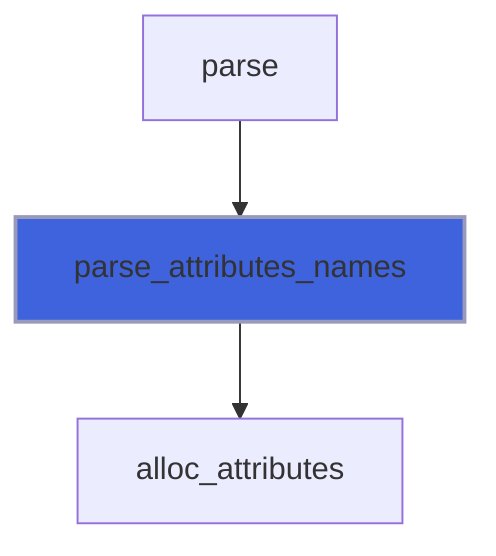

### search

Search tag named *tag_name* into a string and, in case it is found, store into self.

 @note If *tag_name* is not found, self is returned empty.

**Attributes**: elemental

```fortran
subroutine search(self, tag_name, source, tstart, tend)
```

**Arguments**

| Name | Type | Intent | Attributes | Description |
|------|------|--------|------------|-------------|
| `self` | class([xml_tag](/api/src/lib/foxy_xml_tag#xml-tag)) | inout |  | XML tag. |
| `tag_name` | character(len=*) | in |  | Searched tag name. |
| `source` | character(len=*) | in |  | String containing the input. |
| `tstart` | integer(kind=I4P) | out | optional | Starting index of tag inside the source. |
| `tend` | integer(kind=I4P) | out | optional | Ending index of tag inside the source. |

**Call graph**

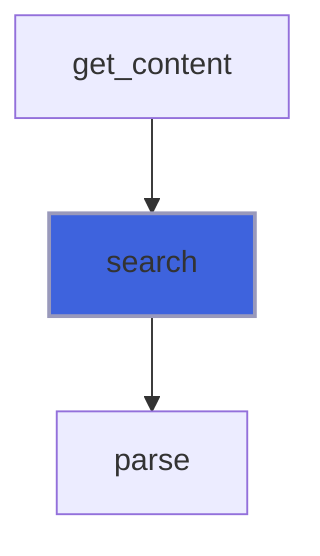

### assign_tag

Assignment between two tags.

**Attributes**: elemental

```fortran
subroutine assign_tag(lhs, rhs)
```

**Arguments**

| Name | Type | Intent | Attributes | Description |
|------|------|--------|------------|-------------|
| `lhs` | class([xml_tag](/api/src/lib/foxy_xml_tag#xml-tag)) | inout |  | Left hand side. |
| `rhs` | type([xml_tag](/api/src/lib/foxy_xml_tag#xml-tag)) | in |  | Right hand side. |

### finalize

Free dynamic memory when finalizing.

**Attributes**: elemental

```fortran
subroutine finalize(tag)
```

**Arguments**

| Name | Type | Intent | Attributes | Description |
|------|------|--------|------------|-------------|
| `tag` | type([xml_tag](/api/src/lib/foxy_xml_tag#xml-tag)) | inout |  | XML tag. |

## Functions

### create_tag_flat

Return an instance of xml tag.

**Attributes**: pure

**Returns**: type([xml_tag](/api/src/lib/foxy_xml_tag#xml-tag))

```fortran
function create_tag_flat(name, attribute, attributes, attributes_stream, sanitize_attributes_value, pos, content, indent, is_content_indented, is_self_closing, id, level, parent_id, attributes_stream_alloc, content_alloc) result(tag)
```

**Arguments**

| Name | Type | Intent | Attributes | Description |
|------|------|--------|------------|-------------|
| `name` | character(len=*) | in |  | Tag name. |
| `attribute` | character(len=*) | in | optional | Attribute name/value pair [1:2]. |
| `attributes` | character(len=*) | in | optional | Attributes list of name/value pairs [1:2,1:]. |
| `attributes_stream` | character(len=*) | in | optional | Attributes list as single stream. |
| `sanitize_attributes_value` | logical | in | optional | Sanitize attributes value. |
| `pos` | integer(kind=I4P) | in | optional | Characters position (in source) indexes. |
| `content` | character(len=*) | in | optional | Tag value. |
| `indent` | integer(kind=I4P) | in | optional | Number of indent-white-spaces. |
| `is_content_indented` | logical | in | optional | Activate content indentation. |
| `is_self_closing` | logical | in | optional | The tag is self closing. |
| `id` | integer(kind=I4P) | in | optional | Uniq ID. |
| `level` | integer(kind=I4P) | in | optional | Tag hierarchy level. |
| `parent_id` | integer(kind=I4P) | in | optional | Parent uniq ID. |
| `attributes_stream_alloc` | character(len=:) | in | allocatable, optional | Attributes list stream, allocatable input. |
| `content_alloc` | character(len=:) | in | allocatable, optional | Tag value, allocatable input. |

**Call graph**

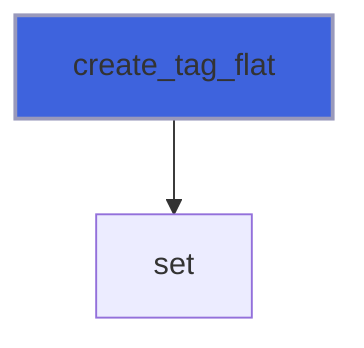

### create_tag_nested

Return an instance of xml tag with value being a nested tag.

**Attributes**: pure

**Returns**: type([xml_tag](/api/src/lib/foxy_xml_tag#xml-tag))

```fortran
function create_tag_nested(name, content, attribute, attributes, attributes_stream, sanitize_attributes_value, pos, indent, is_content_indented, id, level, parent_id, attributes_stream_alloc, content_alloc) result(tag)
```

**Arguments**

| Name | Type | Intent | Attributes | Description |
|------|------|--------|------------|-------------|
| `name` | character(len=*) | in |  | Tag name. |
| `content` | type([xml_tag](/api/src/lib/foxy_xml_tag#xml-tag)) | in |  | Tag value as nested tag.. |
| `attribute` | character(len=*) | in | optional | Attribute name/value pair [1:2]. |
| `attributes` | character(len=*) | in | optional | Attributes list of name/value pairs [1:2,1:]. |
| `attributes_stream` | character(len=*) | in | optional | Attributes list as single stream. |
| `sanitize_attributes_value` | logical | in | optional | Sanitize attributes value. |
| `pos` | integer(kind=I4P) | in | optional | Characters position (in source) indexes. |
| `indent` | integer(kind=I4P) | in | optional | Number of indent-white-spaces. |
| `is_content_indented` | logical | in | optional | Activate value indentation. |
| `id` | integer(kind=I4P) | in | optional | Uniq ID. |
| `level` | integer(kind=I4P) | in | optional | Tag hierarchy level. |
| `parent_id` | integer(kind=I4P) | in | optional | Parent uniq ID. |
| `attributes_stream_alloc` | character(len=:) | in | allocatable, optional | Attributes list stream, allocatable input. |
| `content_alloc` | character(len=:) | in | allocatable, optional | Tag value, allocatable input. |

**Call graph**

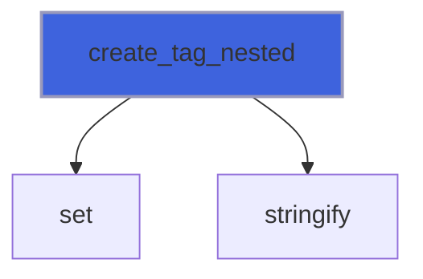

### attributes

Return attributes name/value pairs as string.

**Attributes**: pure

**Returns**: `character(len=:)`

```fortran
function attributes(self) result(att_)
```

**Arguments**

| Name | Type | Intent | Attributes | Description |
|------|------|--------|------------|-------------|
| `self` | class([xml_tag](/api/src/lib/foxy_xml_tag#xml-tag)) | in |  | XML tag. |

**Call graph**

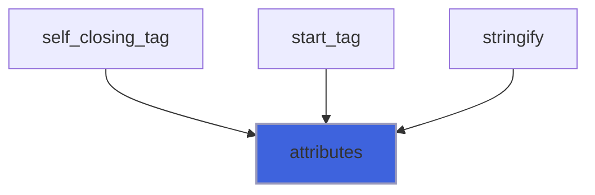

### end_tag

Return `</tag_name>` end tag.

**Attributes**: pure

**Returns**: `character(len=:)`

```fortran
function end_tag(self, is_indented) result(tag_)
```

**Arguments**

| Name | Type | Intent | Attributes | Description |
|------|------|--------|------------|-------------|
| `self` | class([xml_tag](/api/src/lib/foxy_xml_tag#xml-tag)) | in |  | XML tag. |
| `is_indented` | logical | in | optional | Activate content indentation. |

**Call graph**

```mermaid
flowchart TD
  stringify["stringify"] --> end_tag["end_tag"]
  style end_tag fill:#3e63dd,stroke:#99b,stroke-width:2px
```

### is_attribute_present

Return .true. it the queried attribute name is defined, .false. otherwise.

**Attributes**: pure

**Returns**: `logical`

```fortran
function is_attribute_present(self, name) result(is_present)
```

**Arguments**

| Name | Type | Intent | Attributes | Description |
|------|------|--------|------------|-------------|
| `self` | class([xml_tag](/api/src/lib/foxy_xml_tag#xml-tag)) | in |  | XML tag. |
| `name` | character(len=*) | in |  | Attribute name. |

### is_parsed

Check is tag is correctly parsed, i.e. its *tag_name* is allocated.

**Attributes**: elemental

**Returns**: `logical`

```fortran
function is_parsed(self)
```

**Arguments**

| Name | Type | Intent | Attributes | Description |
|------|------|--------|------------|-------------|
| `self` | class([xml_tag](/api/src/lib/foxy_xml_tag#xml-tag)) | in |  | XML tag. |

### name

Return tag name.

**Attributes**: pure

**Returns**: `character(len=:)`

```fortran
function name(self)
```

**Arguments**

| Name | Type | Intent | Attributes | Description |
|------|------|--------|------------|-------------|
| `self` | class([xml_tag](/api/src/lib/foxy_xml_tag#xml-tag)) | in |  | XML tag. |

**Call graph**

```mermaid
flowchart TD
  delete_tag["delete_tag"] --> name["name"]
  style name fill:#3e63dd,stroke:#99b,stroke-width:2px
```

### self_closing_tag

Return `<tag_name.../>` self closing tag.

**Attributes**: pure

**Returns**: `character(len=:)`

```fortran
function self_closing_tag(self, is_indented) result(tag_)
```

**Arguments**

| Name | Type | Intent | Attributes | Description |
|------|------|--------|------------|-------------|
| `self` | class([xml_tag](/api/src/lib/foxy_xml_tag#xml-tag)) | in |  | XML tag. |
| `is_indented` | logical | in | optional | Flag to check if tag is indented. |

**Call graph**

```mermaid
flowchart TD
  stringify["stringify"] --> self_closing_tag["self_closing_tag"]
  self_closing_tag["self_closing_tag"] --> attributes["attributes"]
  style self_closing_tag fill:#3e63dd,stroke:#99b,stroke-width:2px
```

### start_tag

Return `<tag_name...>` start tag.

**Attributes**: pure

**Returns**: `character(len=:)`

```fortran
function start_tag(self, is_indented) result(tag_)
```

**Arguments**

| Name | Type | Intent | Attributes | Description |
|------|------|--------|------------|-------------|
| `self` | class([xml_tag](/api/src/lib/foxy_xml_tag#xml-tag)) | in |  | XML tag. |
| `is_indented` | logical | in | optional | Flag to check if tag is indented. |

**Call graph**

```mermaid
flowchart TD
  stringify["stringify"] --> start_tag["start_tag"]
  start_tag["start_tag"] --> attributes["attributes"]
  style start_tag fill:#3e63dd,stroke:#99b,stroke-width:2px
```

### stringify

Convert the whole tag into a string.

**Attributes**: pure

**Returns**: `character(len=:)`

```fortran
function stringify(self, is_indented, is_content_indented, only_start, only_content, only_end, linearize) result(stringed)
```

**Arguments**

| Name | Type | Intent | Attributes | Description |
|------|------|--------|------------|-------------|
| `self` | class([xml_tag](/api/src/lib/foxy_xml_tag#xml-tag)) | in |  | XML tag. |
| `is_indented` | logical | in | optional | Activate content indentation. |
| `is_content_indented` | logical | in | optional | Activate content indentation. |
| `only_start` | logical | in | optional | Write only start tag. |
| `only_content` | logical | in | optional | Write only content. |
| `only_end` | logical | in | optional | Write only end tag. |
| `linearize` | logical | in | optional | Return a "linearized" string of tags without the XML hieararchy. |

**Call graph**

```mermaid
flowchart TD
  create_tag_nested["create_tag_nested"] --> stringify["stringify"]
  stringify["stringify"] --> stringify["stringify"]
  stringify_recursive["stringify_recursive"] --> stringify["stringify"]
  write_tag["write_tag"] --> stringify["stringify"]
  stringify["stringify"] --> attributes["attributes"]
  stringify["stringify"] --> end_tag["end_tag"]
  stringify["stringify"] --> self_closing_tag["self_closing_tag"]
  stringify["stringify"] --> start_tag["start_tag"]
  style stringify fill:#3e63dd,stroke:#99b,stroke-width:2px
```
