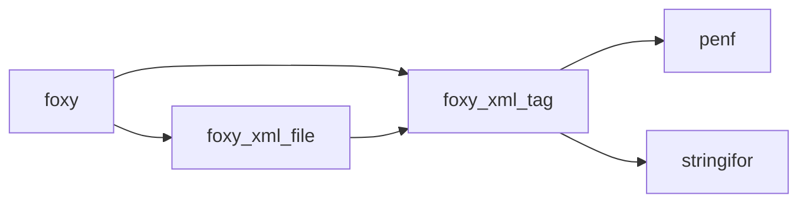

# API Reference Overview

FoXy exposes two public types and the PENF kind parameters through the `foxy` wrapper module.

```fortran
use foxy, only: xml_tag, xml_file
use foxy, only: I1P, I2P, I4P, I8P, R4P, R8P  ! PENF kinds
```

## Module dependency graph



---

## `xml_tag` — single XML element

Defined in `src/lib/foxy_xml_tag.F90`.

### Constructor

```fortran
! flat tag (scalar content)
tag = xml_tag(name, [content], [attribute], [attributes], [attributes_stream], &
              [indent], [is_content_indented], [is_self_closing], &
              [id], [level], [parent_id])

! nested tag (xml_tag content)
tag = xml_tag(name, content=inner_tag, ...)
```

### Key methods

| Method | Description |
|--------|-------------|
| `tag%set(...)` | Set any tag field after construction |
| `tag%parse(source)` | Parse first tag from `source` string |
| `tag%name()` | Return tag name as `character(:)` |
| `tag%stringify([is_indented], [is_content_indented], [only_start], [only_content], [only_end], [linearize])` | Serialise to string |
| `tag%start_tag([is_indented])` | Return `<name...>` |
| `tag%end_tag([is_indented])` | Return `</name>` |
| `tag%self_closing_tag([is_indented])` | Return `<name.../>` |
| `tag%attributes()` | Return all attributes as `att1="v1" att2="v2"` string |
| `tag%add_attributes(attribute=[name,val])` | Add or update one attribute |
| `tag%add_attributes(attributes=matrix)` | Add or update multiple attributes |
| `tag%delete_attributes(name)` | Delete one attribute |
| `tag%delete_attributes(name=array)` | Delete multiple attributes |
| `tag%delete_content()` | Clear text content |
| `tag%is_attribute_present(name)` | Logical: attribute exists? |
| `tag%is_parsed()` | Logical: tag name is allocated? |
| `tag%get_content(name, content)` | Retrieve text content of self or a named nested tag |
| `tag%write(unit, [form], [is_indented], [is_content_indented], [only_start], [only_content], [only_end], [end_record])` | Write to file unit |
| `tag%free()` | Reset all fields |

### Fields (public)

| Field | Type | Description |
|-------|------|-------------|
| `children_number` | `integer(I4P)` | Count of direct children |
| `child_id(:)` | `integer(I4P), allocatable` | IDs of direct children |

---

## `xml_file` — DOM container

Defined in `src/lib/foxy_xml_file.f90`. Holds a flat `tag(:)` array with hierarchy links.

### Key methods

| Method | Description |
|--------|-------------|
| `xfile%parse([string=], [filename=])` | Parse XML from string or file; clears previous data |
| `xfile%stringify([linearize])` | Serialise full DOM to string |
| `xfile%content(name)` | Return text content of first tag named `name` |
| `xfile%add_tag(tag)` | Append a tag to the DOM |
| `xfile%delete_tag(name)` | Remove first tag named `name` |
| `xfile%free()` | Deallocate all data |

---

For full argument lists and call graphs see the [detailed API pages](/api/).
