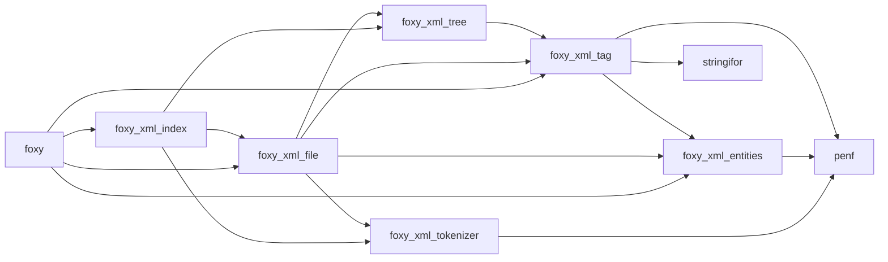

# API Reference Overview

FoXy exposes three public types and the PENF kind parameters through the `foxy` wrapper module.

```fortran
use foxy, only: xml_tag, xml_file, xml_index
use foxy, only: I1P, I2P, I4P, I8P, R4P, R8P  ! PENF kinds
```

## Module dependency graph


```mermaid
graph LR
  foxy["foxy"] --> foxy_xml_file["foxy_xml_file"]
  foxy["foxy"] --> foxy_xml_index["foxy_xml_index"]
  foxy["foxy"] --> foxy_xml_tag["foxy_xml_tag"]
  foxy["foxy"] --> foxy_xml_entities["foxy_xml_entities"]
  foxy_xml_index["foxy_xml_index"] --> foxy_xml_file["foxy_xml_file"]
  foxy_xml_index["foxy_xml_index"] --> foxy_xml_tokenizer["foxy_xml_tokenizer"]
  foxy_xml_index["foxy_xml_index"] --> foxy_xml_tree["foxy_xml_tree"]
  foxy_xml_file["foxy_xml_file"] --> foxy_xml_tokenizer["foxy_xml_tokenizer"]
  foxy_xml_file["foxy_xml_file"] --> foxy_xml_tree["foxy_xml_tree"]
  foxy_xml_file["foxy_xml_file"] --> foxy_xml_tag["foxy_xml_tag"]
  foxy_xml_file["foxy_xml_file"] --> foxy_xml_entities["foxy_xml_entities"]
  foxy_xml_tree["foxy_xml_tree"] --> foxy_xml_tag["foxy_xml_tag"]
  foxy_xml_tokenizer["foxy_xml_tokenizer"] --> penf["penf"]
  foxy_xml_tag["foxy_xml_tag"] --> foxy_xml_entities["foxy_xml_entities"]
  foxy_xml_entities["foxy_xml_entities"] --> penf["penf"]
  foxy_xml_tag["foxy_xml_tag"] --> penf["penf"]
  foxy_xml_tag["foxy_xml_tag"] --> stringifor["stringifor"]
```

---

## `xml_tag` — single XML element

Defined in `src/lib/foxy_xml_tag.F90`.

### Constructor

```fortran
! flat tag (scalar content)
tag = xml_tag(name, [content], [attribute], [attributes], [attributes_stream], &
              [indent], [is_content_indented], [is_self_closing], &
              [id], [level], [parent_id])

! nested tag (xml_tag content)
tag = xml_tag(name, content=inner_tag, ...)
```

### Key methods

| Method | Description |
|--------|-------------|
| `tag%set(...)` | Set any tag field after construction; `attribute_name=`/`attribute_value=` add one attribute with the value stored exactly (no padding as with the `attribute=` pair) |
| `tag%parse(source)` | Parse first tag from `source` string |
| `tag%name()` | Return tag name as `character(:)` |
| `tag%stringify([is_indented], [is_content_indented], [only_start], [only_content], [only_end], [linearize])` | Serialise to string |
| `tag%start_tag([is_indented])` | Return `<name...>` |
| `tag%end_tag([is_indented])` | Return `</name>` |
| `tag%self_closing_tag([is_indented])` | Return `<name.../>` |
| `tag%attributes()` | Return all attributes as `att1="v1" att2="v2"` string |
| `tag%add_attributes(attribute=[name,val])` | Add or update one attribute |
| `tag%add_attributes(attributes=matrix)` | Add or update multiple attributes |
| `tag%delete_attributes(name)` | Delete one attribute |
| `tag%delete_attributes(name=array)` | Delete multiple attributes |
| `tag%delete_content()` | Clear text content |
| `tag%is_attribute_present(name)` | Logical: attribute exists? |
| `tag%is_parsed()` | Logical: tag name is allocated? |
| `tag%get_content(name, content)` | Retrieve text content of self or a named nested tag |
| `tag%get_attribute(name)` | Return the value of attribute `name` (literal tabs, new lines and CRs as spaces, character references decoded), `''` if not defined |
| `tag%get_id()` / `tag%get_parent_id()` | Return the tag ID / its parent ID (`0` for a root tag) |
| `tag%get_tail()` | Return the text after the end tag (mixed content), `''` if none |
| `tag%write(unit, [form], [is_indented], [is_content_indented], [only_start], [only_content], [only_end], [end_record])` | Write to file unit |
| `tag%free()` | Reset all fields |

### Fields (public)

| Field | Type | Description |
|-------|------|-------------|
| `children_number` | `integer(I4P)` | Count of direct children |
| `child_id(:)` | `integer(I4P), allocatable` | IDs of direct children |

---

## `xml_file` — DOM container

Defined in `src/lib/foxy_xml_file.f90`. Holds a flat `tag(:)` array with hierarchy links.

### Key methods

| Method | Description |
|--------|-------------|
| `xfile%parse([string=], [filename=], [iostat=], [iomsg=], [sanitize_attributes_value=], [chunk_size=])` | Parse XML from string or file (read in chunks of `chunk_size` characters, default 1 MiB, never loaded whole); clears previous data. `iostat`: `0`, the runtime I/O error code, or `XML_MALFORMED` (first problem in `iomsg`, as `line N: ...`); the document is built anyway. Attribute values are trimmed of leading/trailing spaces unless `sanitize_attributes_value=.false.` |
| `xfile%stringify([linearize])` | Serialise full DOM to string, prolog first |
| `xfile%save(filename, [is_declared=], [iostat=], [iomsg=])` | Write prolog plus `stringify()` and a final new line to a file; `is_declared=.true.` adds `<?xml version="1.0"?>` if the prolog has none; without `iostat` an I/O error stops the program |
| `xfile%content(name)` | Return the direct text of the first tag named `name` (text plus children tails), without leading/trailing blanks, references decoded, CDATA literal |
| `xfile%content(id=)` | Return the direct text of the tag with ID `id`, as `content(name)` |
| `xfile%find([name=], [path=], [parent=])` | Return the ID of the first matching tag, `0` if none |
| `xfile%find_all([name=], [path=], [parent=])` | Return the IDs of all matching tags, in document order |
| `xfile%children(id)` | Return the IDs of the direct children of tag `id` (`0`: root tags) |
| `xfile%attribute(id, name)` | Return the value of attribute `name` of tag `id`, as `get_attribute`, `''` if not defined |
| `xfile%name(id)` / `xfile%parent(id)` / `xfile%level(id)` | Return the name (`''`), parent ID and level (1 for a root tag) of tag `id` (`0` if it does not exist) |
| `xfile%add_tag(tag)` | Append a root tag to the DOM (its ID is its index) |
| `xfile%delete_tag(name)` | Remove first tag named `name` with its whole subtree; remaining IDs are renumbered |
| `xfile%free()` | Deallocate all data |

`XML_MALFORMED` (`9001`) is a public constant of `foxy_xml_file`, re-exported by `foxy`.

---

## `xml_index` — index of a file, content on demand

Defined in `src/lib/foxy_xml_index.f90`. Holds the tags of a file (name, attributes, hierarchy, positions in the file)
without their content, which is read from the file on demand: the memory used does not depend on the data held in the
file. Positions are 1-based byte offsets (`integer(I8P)`).

| Method | Description |
|--------|-------------|
| `idx%scan(filename, [stop_at=], [chunk_size=], [iostat=], [iomsg=], [sanitize_attributes_value=])` | Index a file, read in chunks (default 64 KiB); with `stop_at` the scan stops after the start tag of the first tag with that name (e.g. `AppendedData`, before raw binary data); errors as `xfile%parse` |
| `idx%find(...)`, `idx%find_all(...)`, `idx%children(id)`, `idx%attribute(id, name)`, `idx%name(id)`, `idx%parent(id)`, `idx%level(id)` | The `xml_file` queries, same arguments and results |
| `idx%content(id, [iostat=], [iomsg=])` | Read the content of tag `id` from the file, as `xfile%content(id=)`; `''` for a self-closing or unclosed tag |
| `idx%text_range(id, first, last)` | Byte range of the text of tag `id` (up to its first child); `last < first` if empty |
| `idx%content_range(id, first, last)` | Byte range of the whole content of tag `id` (children included) |
| `idx%stop_position()` | Byte position after the `stop_at` start tag, `0` if the scan did not stop |
| `idx%free()` | Deallocate all data |

---

## Character references

Defined in `src/lib/foxy_xml_entities.f90`, re-exported by `foxy`.

| Function | Description |
|----------|-------------|
| `xml_unescape(string)` | Decode `&lt;` `&gt;` `&amp;` `&quot;` `&apos;`, `&#N;` and `&#xH;` (as UTF-8); unknown or invalid references are left verbatim |
| `xml_escape(string)` | Replace `&`, `<` and `"` with their references, for use as content or attribute value |

Stored tags keep the source text: `stringify()` reproduces references as parsed, while `content()`, `attribute()` and
`get_attribute()` return decoded values. Content set programmatically may contain markup (e.g. a nested tag), so it is
**not** escaped on output: escape user data with `xml_escape` before setting it.

---

For full argument lists and call graphs see the [detailed API pages](/api/).
