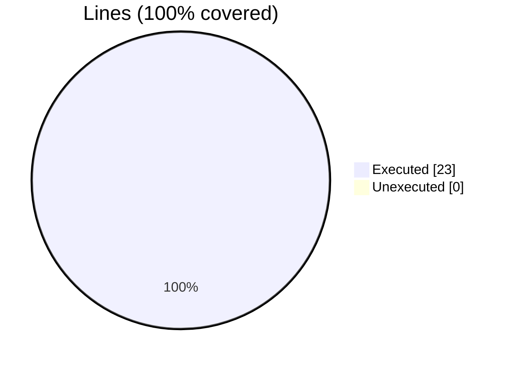
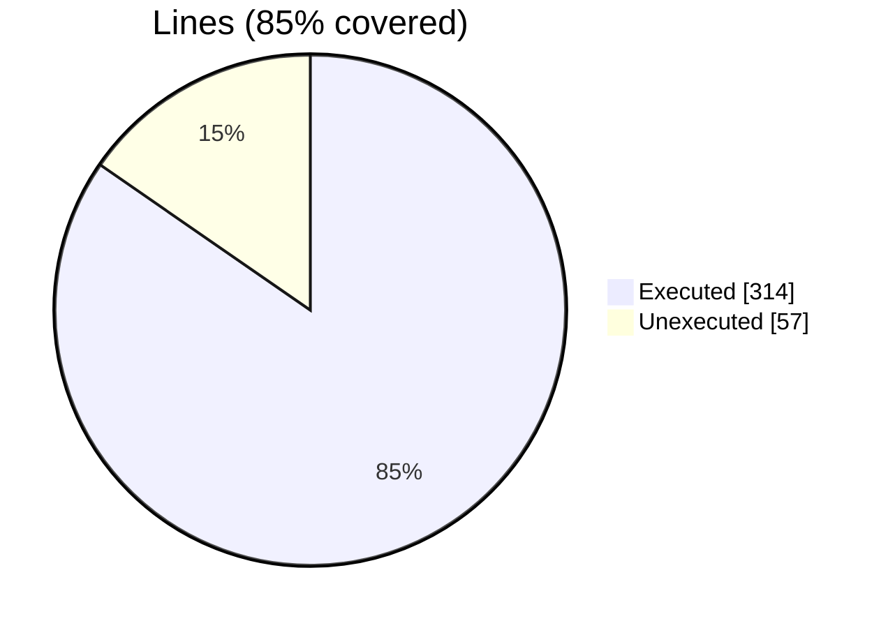
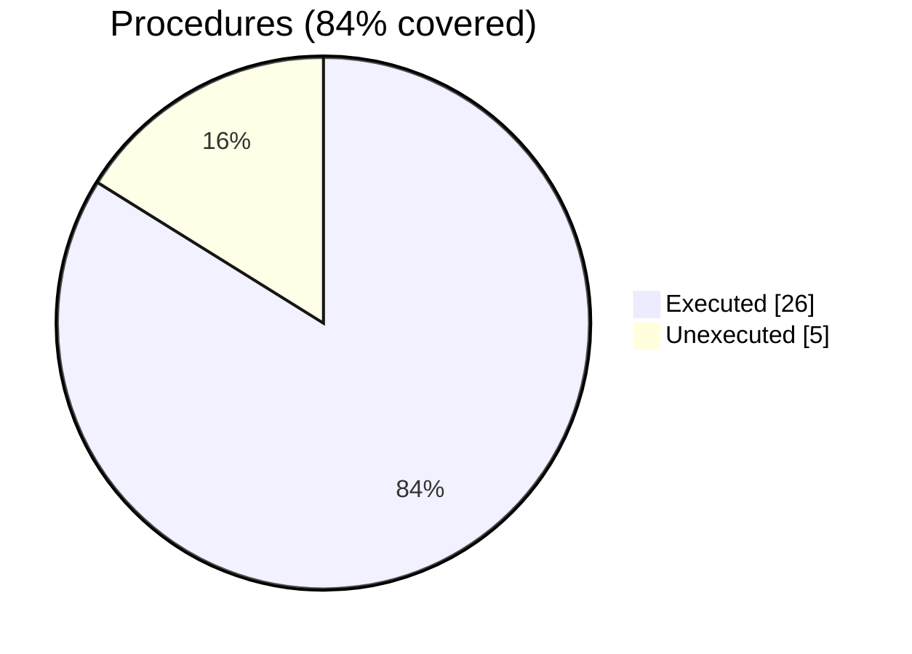
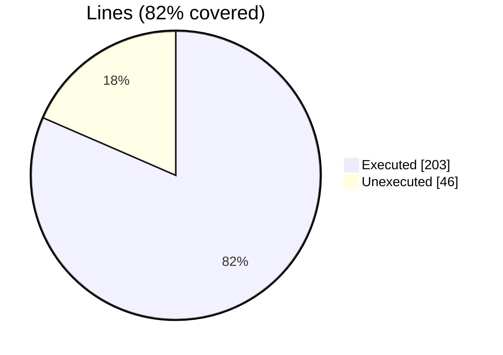
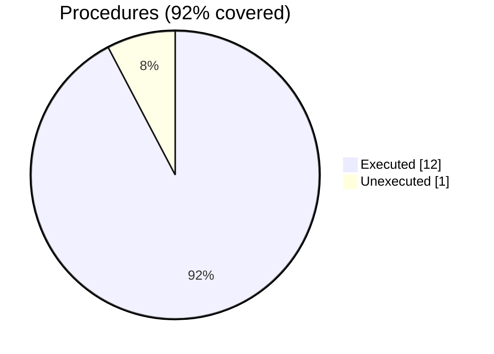

### coverage-analysis

#### [[foxy_test_parse_file_simple.f90.gcov]]

|Lines| | |
| --- | --- | --- |
|Executable lines            |23| |
|Executed lines              |23|100%|
|Unexecuted lines            |0|0%|
|Average hits / executed     |3.130434782608696| |

```mermaid
pie showData
    title Lines (100% covered)
    "Executed" : 23
    "Unexecuted" : 0
```

#### [[foxy_test_create_tag.f90.gcov]]

|Lines| | |
| --- | --- | --- |
|Executable lines            |42| |
|Executed lines              |42|100%|
|Unexecuted lines            |0|0%|
|Average hits / executed     |5.642857142857143| |

```mermaid
pie showData
    title Lines (100% covered)
    "Executed" : 42
    "Unexecuted" : 0
```

#### [[foxy_test_delete_tag.f90.gcov]]

|Lines| | |
| --- | --- | --- |
|Executable lines            |25| |
|Executed lines              |25|100%|
|Unexecuted lines            |0|0%|
|Average hits / executed     |3.24| |

```mermaid
pie showData
    title Lines (100% covered)
    "Executed" : 25
    "Unexecuted" : 0
```

#### [[foxy_test_delete_attributes.f90.gcov]]

|Lines| | |
| --- | --- | --- |
|Executable lines            |39| |
|Executed lines              |39|100%|
|Unexecuted lines            |0|0%|
|Average hits / executed     |8.307692307692308| |

```mermaid
pie showData
    title Lines (100% covered)
    "Executed" : 39
    "Unexecuted" : 0
```

#### [[foxy_test_write_tag.f90.gcov]]

|Lines| | |
| --- | --- | --- |
|Executable lines            |51| |
|Executed lines              |51|100%|
|Unexecuted lines            |0|0%|
|Average hits / executed     |5.117647058823529| |

```mermaid
pie showData
    title Lines (100% covered)
    "Executed" : 51
    "Unexecuted" : 0
```

#### [[foxy_xml_tag.F90.gcov]]

|Lines| | |
| --- | --- | --- |
|Executable lines            |371| |
|Executed lines              |314|85%|
|Unexecuted lines            |57|15%|
|Average hits / executed     |295.2420382165605| |

```mermaid
pie showData
    title Lines (85% covered)
    "Executed" : 314
    "Unexecuted" : 57
```

|Procedures| | |
| --- | --- | --- |
|Total procedures            |31| |
|Executed procedures         |26|84%|
|Unexecuted procedures       |5|16%|
|Average hits / executed     |166.96153846153845| |

```mermaid
pie showData
    title Procedures (84% covered)
    "Executed" : 26
    "Unexecuted" : 5
```

#### [[foxy_xml_file.f90.gcov]]

|Lines| | |
| --- | --- | --- |
|Executable lines            |249| |
|Executed lines              |203|82%|
|Unexecuted lines            |46|18%|
|Average hits / executed     |112.04926108374384| |

```mermaid
pie showData
    title Lines (82% covered)
    "Executed" : 203
    "Unexecuted" : 46
```

|Procedures| | |
| --- | --- | --- |
|Total procedures            |13| |
|Executed procedures         |12|92%|
|Unexecuted procedures       |1|8%|
|Average hits / executed     |84.75| |

```mermaid
pie showData
    title Procedures (92% covered)
    "Executed" : 12
    "Unexecuted" : 1
```

#### [[foxy_test_parse_string_simple.f90.gcov]]

|Lines| | |
| --- | --- | --- |
|Executable lines            |18| |
|Executed lines              |18|100%|
|Unexecuted lines            |0|0%|
|Average hits / executed     |3.1666666666666665| |

```mermaid
pie showData
    title Lines (100% covered)
    "Executed" : 18
    "Unexecuted" : 0
```

#### [[foxy_test_delete_content.f90.gcov]]

|Lines| | |
| --- | --- | --- |
|Executable lines            |18| |
|Executed lines              |18|100%|
|Unexecuted lines            |0|0%|
|Average hits / executed     |6.166666666666667| |

```mermaid
pie showData
    title Lines (100% covered)
    "Executed" : 18
    "Unexecuted" : 0
```

#### [[foxy_test_indent_tag.f90.gcov]]

|Lines| | |
| --- | --- | --- |
|Executable lines            |24| |
|Executed lines              |24|100%|
|Unexecuted lines            |0|0%|
|Average hits / executed     |3.625| |

```mermaid
pie showData
    title Lines (100% covered)
    "Executed" : 24
    "Unexecuted" : 0
```

#### [[foxy_test_add_attributes.f90.gcov]]

|Lines| | |
| --- | --- | --- |
|Executable lines            |32| |
|Executed lines              |32|100%|
|Unexecuted lines            |0|0%|
|Average hits / executed     |4.96875| |

```mermaid
pie showData
    title Lines (100% covered)
    "Executed" : 32
    "Unexecuted" : 0
```

#### [[foxy_test_parse_string_nested_tags.f90.gcov]]

|Lines| | |
| --- | --- | --- |
|Executable lines            |26| |
|Executed lines              |26|100%|
|Unexecuted lines            |0|0%|
|Average hits / executed     |3.1153846153846154| |

```mermaid
pie showData
    title Lines (100% covered)
    "Executed" : 26
    "Unexecuted" : 0
```

#### [[foxy_test_add_tag.f90.gcov]]

|Lines| | |
| --- | --- | --- |
|Executable lines            |28| |
|Executed lines              |28|100%|
|Unexecuted lines            |0|0%|
|Average hits / executed     |6.642857142857143| |

```mermaid
pie showData
    title Lines (100% covered)
    "Executed" : 28
    "Unexecuted" : 0
```

