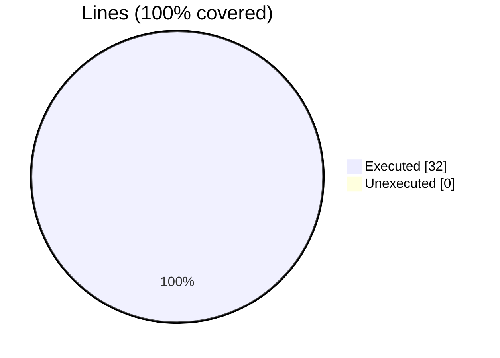

### coverage-analysis

#### [[foxy_test_add_attributes.f90.gcov]]

|Lines| | |
| --- | --- | --- |
|Executable lines            |32| |
|Executed lines              |32|100%|
|Unexecuted lines            |0|0%|
|Average hits / executed     |1.65625| |

