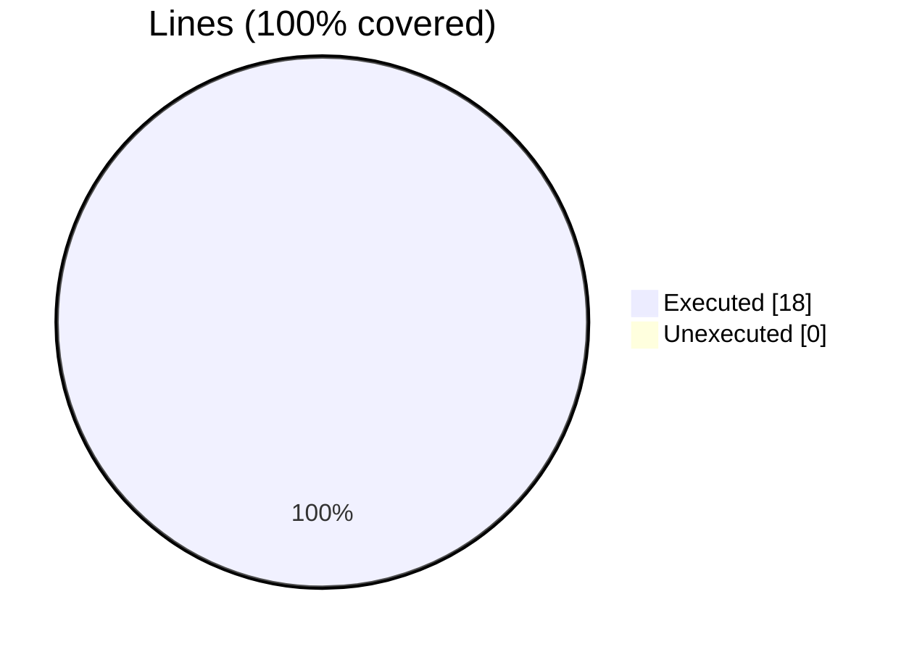

### Coverage analysis of *foxy_test_delete_content.f90*

|Lines| | |
| --- | --- | --- |
|Executable lines            |18| |
|Executed lines              |18|100%|
|Unexecuted lines            |0|0%|
|Average hits / executed     |6.166666666666667| |

#### Unexecuted procedures

 + *none*

#### Executed procedures

 + *none*

 --- 
 Report generated by [FoBiS.py](https://github.com/szaghi/FoBiS)