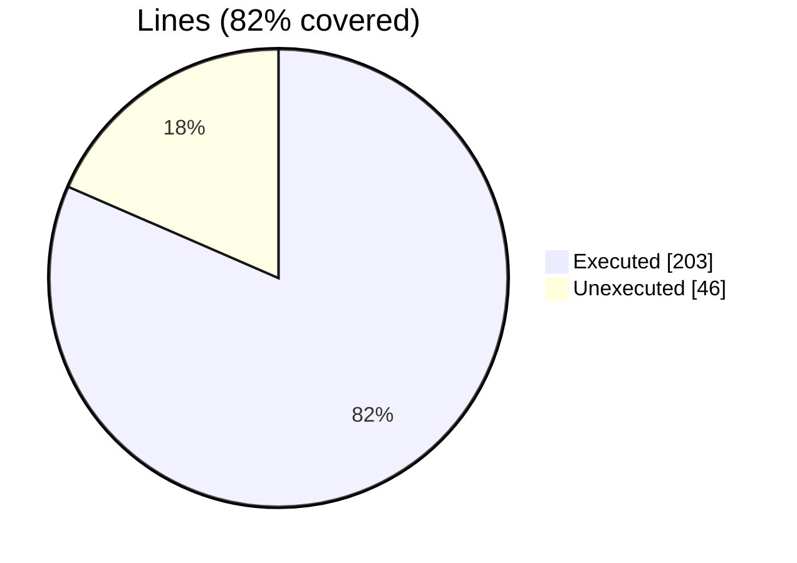
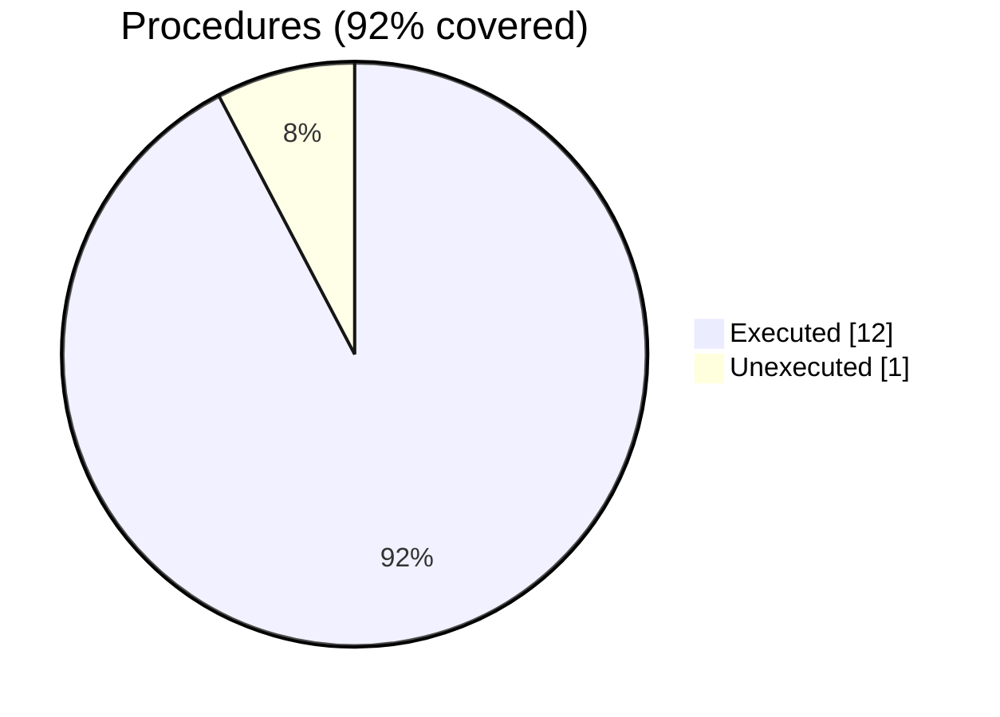

### Coverage analysis of *foxy_xml_file.f90*

|Lines| | |
| --- | --- | --- |
|Executable lines            |249| |
|Executed lines              |203|82%|
|Unexecuted lines            |46|18%|
|Average hits / executed     |112.04926108374384| |

|Procedures| | |
| --- | --- | --- |
|Total procedures            |13| |
|Executed procedures         |12|92%|
|Unexecuted procedures       |1|8%|
|Average hits / executed     |84.75| |

#### Unexecuted procedures

 + *function* **content**, line 51

#### Executed procedures

 + *subroutine* **parse_tag_name**: tested **228** times
 + *subroutine* **get_tag_content**: tested **213** times
 + *subroutine* **finalize**: tested **156** times
 + *subroutine* **add_tag**: tested **135** times
 + *subroutine* **find_matching_end_tag**: tested **108** times
 + *subroutine* **add_child**: tested **45** times
 + *subroutine* **free**: tested **42** times
 + *function* **stringify**: tested **30** times
 + *subroutine* **parse**: tested **21** times
 + *subroutine* **parse_from_string**: tested **21** times
 + *function* **load_file_as_stream**: tested **12** times
 + *subroutine* **delete_tag**: tested **6** times

 --- 
 Report generated by [FoBiS.py](https://github.com/szaghi/FoBiS)