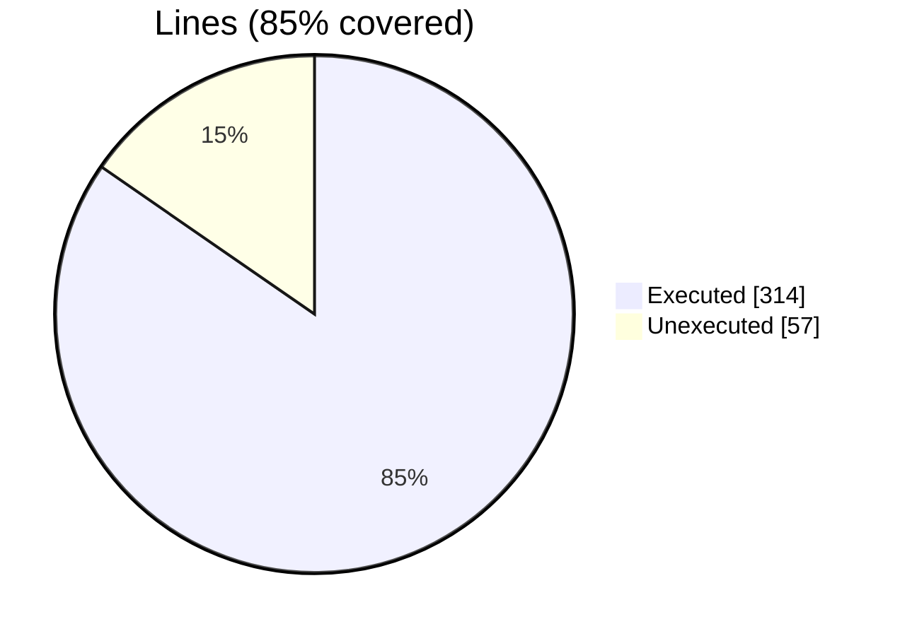
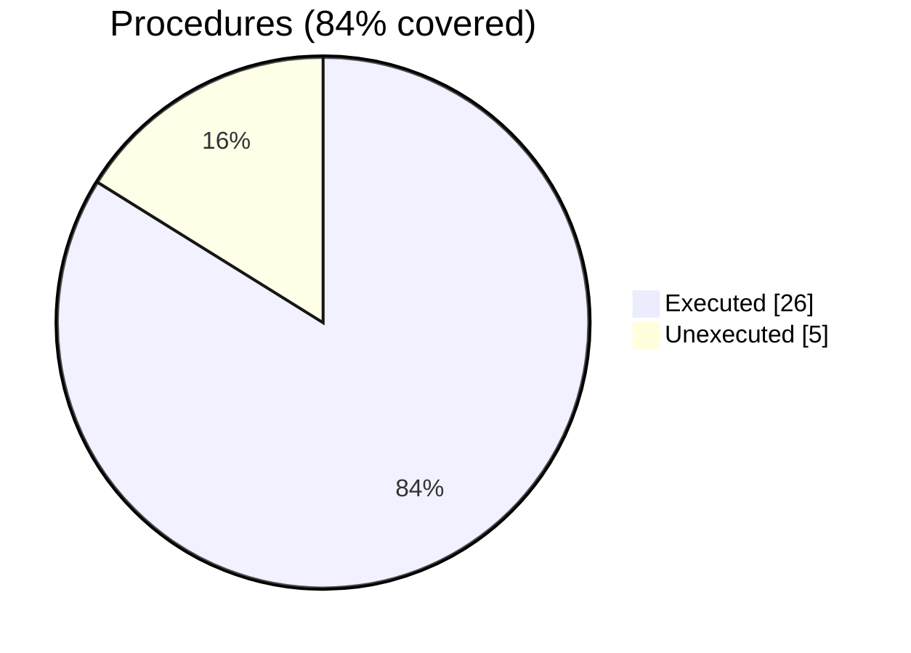

### Coverage analysis of *foxy_xml_tag.F90*

|Lines| | |
| --- | --- | --- |
|Executable lines            |371| |
|Executed lines              |314|85%|
|Unexecuted lines            |57|15%|
|Average hits / executed     |295.2420382165605| |

|Procedures| | |
| --- | --- | --- |
|Total procedures            |31| |
|Executed procedures         |26|84%|
|Unexecuted procedures       |5|16%|
|Average hits / executed     |166.96153846153845| |

#### Unexecuted procedures

 + *function* **is_attribute_present**, line 250
 + *function* **is_parsed**, line 268
 + *subroutine* **finalize**, line 895
 + *subroutine* **get_content**, line 228
 + *subroutine* **search**, line 821

#### Executed procedures

 + *subroutine* **free**: tested **1698** times
 + *subroutine* **assign_tag**: tested **864** times
 + *subroutine* **add_single_attribute**: tested **285** times
 + *function* **stringify**: tested **273** times
 + *function* **attributes**: tested **213** times
 + *subroutine* **set**: tested **180** times
 + *function* **end_tag**: tested **168** times
 + *function* **start_tag**: tested **168** times
 + *subroutine* **alloc_attributes**: tested **150** times
 + *subroutine* **add_stream_attributes**: tested **108** times
 + *function* **create_tag_flat**: tested **51** times
 + *subroutine* **add_child_id**: tested **45** times
 + *subroutine* **add_multiple_attributes**: tested **33** times
 + *function* **self_closing_tag**: tested **21** times
 + *subroutine* **write_tag**: tested **15** times
 + *subroutine* **delete_single_attribute**: tested **15** times
 + *function* **name**: tested **9** times
 + *subroutine* **parse**: tested **6** times
 + *subroutine* **parse_tag_name**: tested **6** times
 + *subroutine* **get**: tested **6** times
 + *subroutine* **get_attributes**: tested **6** times
 + *subroutine* **get_value**: tested **6** times
 + *subroutine* **parse_attributes_names**: tested **6** times
 + *function* **create_tag_nested**: tested **3** times
 + *subroutine* **delete_content**: tested **3** times
 + *subroutine* **delete_multiple_attributes**: tested **3** times

 --- 
 Report generated by [FoBiS.py](https://github.com/szaghi/FoBiS)